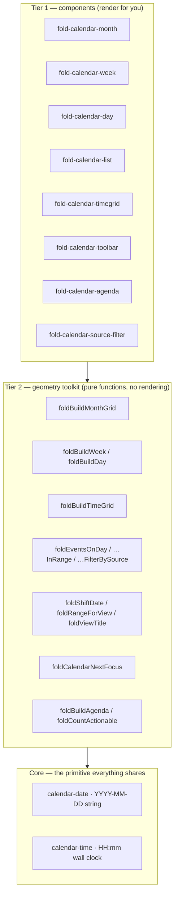
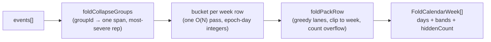

# The calendar family — `fold-calendar-*`

A read-only, themeable calendar for Angular 22, built on two decisions that the
rest of the design follows from.

1. **A date is a `YYYY-MM-DD` string, never a `Date`.** A calendar of all-day
   spans deals in _plain dates_ — "the 18th of May", with no instant and no
   zone. `new Date("2026-05-18")` is UTC midnight, which is the _17th_ west of
   Greenwich; modelling the domain as a string removes that entire bug class by
   construction, and buys three things for free: values compare
   **lexicographically** (`a <= b` _is_ "on or before"), they are `===`-equal
   when they mean the same day, and they are already the wire format every
   backend sends.
2. **It displays; it never originates.** The family knows nothing of the domain
   it plots — an app maps its records onto `FoldCalendarEvent` and gets them
   back, still typed, on every output. There is no drag-create, no range select,
   no write path, because validation and persistence belong to the consumer.
   This is a decision, not a stage it will grow out of — see
   [Scope](#scope--what-it-will-not-do).

Everything else — the eight components, the geometry toolkit, the localisation —
is downstream of those two.

> **Status.** Unreleased (targeting `0.8.0`). 1057 package tests + 26 Playwright
> e2e, all gates green. The API below is checked against the source in
> `src/components/content/calendar/`.

---

## Contents

- [At a glance](#at-a-glance)
- [Quick start](#quick-start)
- [The data model](#the-data-model)
- [Components](#components)
  - [`fold-calendar-month`](#fold-calendar-month)
  - [`fold-calendar-week`](#fold-calendar-week)
  - [`fold-calendar-day`](#fold-calendar-day)
  - [`fold-calendar-list`](#fold-calendar-list)
  - [`fold-calendar-timegrid`](#fold-calendar-timegrid)
  - [`fold-calendar-toolbar`](#fold-calendar-toolbar)
  - [`fold-calendar-agenda`](#fold-calendar-agenda)
  - [`fold-calendar-source-filter`](#fold-calendar-source-filter)
- [Composition patterns](#composition-patterns)
- [Slots & templates](#slots--templates)
- [Localisation](#localisation)
- [The geometry toolkit](#the-geometry-toolkit)
- [Date & time primitives](#date--time-primitives)
- [How the month lays out](#how-the-month-lays-out)
- [Accessibility](#accessibility)
- [Performance](#performance)
- [Scope — what it will not do](#scope--what-it-will-not-do)

---

## At a glance

The family is **two tiers**. Most apps only touch the first.



- **Tier 1** is what you reach for first: drop a component in, bind `events`,
  handle a click. Each renders, packs, clips, localises and handles the keyboard
  for you.
- **Tier 2** is the same geometry with the rendering removed. If you need a
  month laid out but drawn your own way, call `foldBuildMonthGrid` and render
  the rows yourself — you still get the lane packing, the week-boundary
  clipping, the open edges and (with `foldCalendarNextFocus`) the arrow keys.
  This is why those functions are public: a hand-rolled date grid owes its users
  the same behaviour as the built-in one.

| Component                     | Reading it gives                                 | Generic |
| ----------------------------- | ------------------------------------------------ | ------- |
| `fold-calendar-month`         | Spanning bands across a 7-column month grid      | `<T>`   |
| `fold-calendar-week`          | Seven day columns of stacked chips               | `<T>`   |
| `fold-calendar-day`           | One day, its events in full                      | `<T>`   |
| `fold-calendar-list`          | A flat, date-ordered list of a range             | `<T>`   |
| `fold-calendar-timegrid`      | Hour columns + an all-day strip (day / week)     | `<T>`   |
| `fold-calendar-toolbar`       | Today / prev-next / title / view switch          | —       |
| `fold-calendar-agenda`        | A rail of "what's next", grouped by day          | `<T>`   |
| `fold-calendar-source-filter` | Chips that toggle each feed of a merged calendar | —       |

---

## Quick start

A month with a toolbar above it and a click that opens a day. `month` is a
two-way `model`, so keyboard paging and the toolbar write straight back to it.

```ts
import { Component, signal } from "@angular/core";
import {
  FoldCalendarMonthComponent,
  FoldCalendarToolbarComponent,
  foldToday,
  type FoldCalendarEvent,
} from "fold-ng";

@Component({
  selector: "app-planning",
  standalone: true,
  imports: [FoldCalendarMonthComponent, FoldCalendarToolbarComponent],
  template: `
    <fold-calendar-toolbar [(date)]="month" [(view)]="view" />
    <fold-calendar-month
      [(month)]="month"
      [events]="events()"
      [today]="today"
      (dayClick)="openDay($event)"
      (eventClick)="openEvent($event)"
    />
  `,
})
export class PlanningComponent {
  protected readonly today = foldToday();
  protected readonly month = signal(this.today);
  protected readonly view = signal("month");

  protected readonly events = signal<readonly FoldCalendarEvent<MyRecord>[]>([
    {
      id: "leave-42",
      start: "2026-05-18",
      end: "2026-05-22",
      label: "Léa — annual leave",
      tone: "warning",
      icon: "plane",
      data: myRecord,
    },
  ]);

  protected openDay(date: string) {
    /* switch to the day view, load that date */
  }
  protected openEvent(event: FoldCalendarEvent<MyRecord>) {
    /* event.data is MyRecord, no cast */
  }
}
```

Two things worth internalising from this snippet:

- **`dayClick` is load-bearing, not optional.** In the month view the bands are
  `aria-hidden` mouse affordances (they span columns, so they cannot be grid
  cells); the accessible path into an event is _click a day → open the day or
  list view_. A month wired only to `eventClick` is a view no keyboard can
  reach. See [Accessibility](#accessibility).
- **`today` is an input, not read from a clock.** Omit it and nothing is marked
  — the package owns no clock, so an SSR render can't invent one and hydrate to
  a different answer. Pass `foldToday()` (or a workspace clock) explicitly.

---

## The data model

One interface carries every event through every view.
[`calendar.types.ts`]

```ts
interface FoldCalendarEvent<T = unknown> {
  id: string; //  Stable identity AND the layout key — unique per render.
  start: FoldCalendarDate; //  First day, inclusive.
  end: FoldCalendarDate; //  Last day, inclusive. `start === end` is one day.
  label: string; //  Primary text on the chip.
  subline?: string; //  Secondary line — status, duration, venue.
  tone?: FoldCalendarTone; //  Semantic weight. @default 'neutral'
  icon?: FoldIconName; //  Leading glyph, drawn with fold-icon.
  startTime?: FoldCalendarTime; //  Wall-clock HH:mm — see the time grid.
  endTime?: FoldCalendarTime; //  Both times ⇒ placed on the clock.
  startHalfDay?: FoldCalendarHalfDay; //  'morning' | 'afternoon' edge.
  endHalfDay?: FoldCalendarHalfDay;
  groupId?: string; //  Collapse a bulk set into one counted chip.
  groupLabel?: string; //  Label for that collapsed chip.
  openStart?: boolean; //  Real range extends before what was loaded.
  openEnd?: boolean; //  …or after (an open-ended contract).
  sourceKey?: string; //  Which feed this came from (source filter).
  data?: T; //  Your record, handed back untouched on every output.
}
```

### Tone

`tone` is the one semantic axis, and it is an **input, not derived**: a band
that turns amber then red as an account sits unactivated, and a band that is
amber because a leave request is pending, are the same component being told two
different things. The app computes the tone; the calendar paints it.

| Tone      | Severity | Reads as                                         |
| --------- | -------- | ------------------------------------------------ |
| `alert`   | 4        | Needs attention now (also feeds the agenda todo) |
| `warning` | 3        | Watch this (also feeds the agenda todo)          |
| `success` | 2        | Confirmed / done                                 |
| `neutral` | 1        | The default                                      |
| `muted`   | 0        | Struck-through, dimmed — "no longer counts"      |

The severity order is what a **collapsed group** uses to pick its
representative (below), and what the [agenda](#fold-calendar-agenda) reads to
decide what is "to handle" — one scale, never a second notion of urgency.

### Groups, open edges and half-days

- **`groupId`** collapses every event sharing the key into one chip carrying a
  count — for a bulk action that would otherwise flood the grid (a whole team
  off the same days). The chip covers the **union** of the members' ranges, is
  open-ended if **any** member is, and takes its tone / icon / label / subline /
  `sourceKey` from **one real member**: the most severe by tone, ties going to
  document order. Picking one real event rather than merging fields keeps the
  chip something that exists in the feed, and stops a first cancelled member
  from greying out a group that contains an alert.
- **`openStart` / `openEnd`** draw the same open edge as a span continuing from
  an earlier week — for a range the caller clamped to the queried window, or a
  contract with no known end.
- **`startHalfDay` / `endHalfDay`** render a half-filled edge, kept only on the
  segment that holds the event's _real_ start or end (a mid-span week never
  shows one).

### Sources

For a calendar that merges feeds (a programme, staff leave, contracts), an event
names its own with `sourceKey`, and a `FoldCalendarSource` declares how the
filter lists it:

```ts
interface FoldCalendarSource {
  key: string; //  Matches FoldCalendarEvent.sourceKey.
  label: string; //  Shown on the chip.
  tone?: FoldCalendarTone; //  Dot colour. @default 'neutral'
}
```

An event with **no** `sourceKey` belongs to no feed, so no chip can hide it.

---

## Components

Every component is `standalone`, zoneless-safe, and applies the internal
`FoldCalendarChromeDirective` through `hostDirectives` — which is why `locale`,
`labels` and `formats` are ordinary inputs on all eight even though they live in
one shared place. Inputs use signal `input()`/`model()`; outputs are signal
`output()`.

### `fold-calendar-month`

A month grid where events span the days they cover. The one view with genuine
2-D geometry: bands pack into lanes, cross week boundaries as separate segments,
and overflow into a per-day `+N` chip when the lane budget is spent.

**Selector** `fold-calendar-month` · generic `<T>`

| Input             | Type                                                              | Default      | Meaning                                                                   |
| ----------------- | ----------------------------------------------------------------- | ------------ | ------------------------------------------------------------------------- |
| `month`           | `FoldCalendarDate`                                                | —            | **Two-way `model`, required.** Any date in the month; paging writes back. |
| `events`          | `FoldCalendarEvent<T>[]`                                          | `[]`         | What to plot. Anything off the grid is ignored.                           |
| `today`           | `FoldCalendarDate`                                                | —            | The day to mark. Omit → nothing marked.                                   |
| `weekStartsOn`    | `FoldWeekday`                                                     | the locale's | Which day opens the row (override; the locale knows).                     |
| `weekendDays`     | `FoldWeekday[]`                                                   | the locale's | Which days are shaded — a separate fact from the anchor.                  |
| `showWeekNumbers` | `boolean`                                                         | `false`      | An ISO week number in a leading column.                                   |
| `maxLanes`        | `number`                                                          | `3`          | Bands a week stacks before the rest overflow.                             |
| `fixedWeeks`      | `boolean`                                                         | `false`      | Always six rows, so the grid keeps one height across months.              |
| `dayModifiers`    | `(day) => string[]`                                               | —            | Extra names per cell, emitted as `data-fold-day-<name>`.                  |
| `locale`          | `string`                                                          | runtime      | Drives month/weekday names through `Intl`.                                |
| `labels`          | `Partial<FoldCalendarLabels>`                                     | —            | Per-instance string overrides.                                            |
| `formats`         | `Partial<Record<FoldCalendarFormat, Intl.DateTimeFormatOptions>>` | —            | Per-instance `Intl` reformatting.                                         |

| Output          | Payload                | Fires on                                                 |
| --------------- | ---------------------- | -------------------------------------------------------- |
| `dayClick`      | `FoldCalendarDate`     | A day cell activated by click, `Enter` or `Space`.       |
| `eventClick`    | `FoldCalendarEvent<T>` | A band clicked; a grouped band emits its representative. |
| `overflowClick` | `FoldCalendarDate`     | A `+N` chip — the **day** whose events overflowed.       |

**Templates:** `foldCalendarEvent` (the chip), `foldCalendarDay` (inside a day
cell), `foldCalendarOverflow` (the `+N` chip). See [Slots &
templates](#slots--templates).

**Theming (CSS variables):** `--fold-calendar-month-header-row` (30px),
`--fold-calendar-month-lane` (22px), `--fold-calendar-month-row-min-height`
(112px), `--fold-calendar-month-daynum-size` (22px),
`--fold-calendar-month-cell-padding`, `--fold-calendar-month-week-number-width`
(34px), `--fold-calendar-bar-width` (3px), `--fold-calendar-band-radius`,
`--fold-calendar-band-gutter`.

### `fold-calendar-week`

One week as seven day columns of stacked chips. Nothing spans, so nothing is
clipped and there is no overflow — a three-day event simply appears under all
three days.

**Selector** `fold-calendar-week` · generic `<T>`

| Input                           | Type                     | Default      | Meaning                                                                                  |
| ------------------------------- | ------------------------ | ------------ | ---------------------------------------------------------------------------------------- |
| `date`                          | `FoldCalendarDate`       | —            | **Required input** (not a `model` — this view never pages itself). Any date in the week. |
| `events`                        | `FoldCalendarEvent<T>[]` | `[]`         | What to list.                                                                            |
| `today`                         | `FoldCalendarDate`       | —            | The day to mark.                                                                         |
| `weekStartsOn`                  | `FoldWeekday`            | the locale's | Which day opens the week.                                                                |
| `weekendDays`                   | `FoldWeekday[]`          | the locale's | Which days are shaded.                                                                   |
| `locale` / `labels` / `formats` | —                        | —            | See the chrome inputs above.                                                             |

**Outputs:** `dayClick` (a column header), `eventClick` (a chip).
**Theming:** `--fold-calendar-week-column-height` (320px), `--fold-calendar-bar-width`, `--fold-calendar-band-radius`.

Pair it with `<fold-calendar-toolbar>`, which owns the paging.

### `fold-calendar-day`

One day, its events listed in full — the end of the drill-down, so it is where a
`dayClick` naturally lands. Has room for the `subline` the month view does not.

**Selector** `fold-calendar-day` · generic `<T>`

| Input                           | Type                     | Default | Meaning                            |
| ------------------------------- | ------------------------ | ------- | ---------------------------------- |
| `date`                          | `FoldCalendarDate`       | —       | **Required.** The day on display.  |
| `events`                        | `FoldCalendarEvent<T>[]` | `[]`    | Filtered to those covering `date`. |
| `today`                         | `FoldCalendarDate`       | —       | Marks the header when it matches.  |
| `locale` / `labels` / `formats` | —                        | —       | Chrome inputs.                     |

**Output:** `eventClick`.
**Slots:** `button[empty]`, `a[empty]`, `div[empty]` (under the empty message —
the place for a "new request" action) and a default slot after the list. The
`empty` slot is **tag-qualified** because `empty` is also an input on
`fold-field` / `fold-data-table`.
**Theming:** `--fold-calendar-day-number-size`, `--fold-calendar-bar-width`, `--fold-calendar-band-radius`.

```html
<fold-calendar-day [date]="date()" [events]="events()" [today]="today">
  <button empty foldButton (click)="request()">New request</button>
</fold-calendar-day>
```

### `fold-calendar-list`

Everything in a range, in date order — no grid, no packing, so nothing is ever
hidden behind a lane budget. Each row leads with the span it covers. For a
sortable, column-configurable table instead, feed `foldEventsInRange()` straight
into `FoldDataTableComponent`.

**Selector** `fold-calendar-list` · generic `<T>`

| Input                           | Type                     | Default | Meaning                                           |
| ------------------------------- | ------------------------ | ------- | ------------------------------------------------- |
| `events`                        | `FoldCalendarEvent<T>[]` | `[]`    | Source events.                                    |
| `from`                          | `FoldCalendarDate`       | —       | Range start; omit (with `to`) to list everything. |
| `to`                            | `FoldCalendarDate`       | —       | Range end.                                        |
| `locale` / `labels` / `formats` | —                        | —       | Chrome inputs.                                    |

**Output:** `eventClick`. **Template:** `foldCalendarEvent` replaces the row's
**whole** inside. **Theming:** `--fold-calendar-list-date-width` (7rem),
`--fold-calendar-bar-width`.

### `fold-calendar-timegrid`

Days as hour columns with an all-day strip on top — the reading the other four
cannot give: **when inside a day**. A timed event (one carrying **both**
`startTime` and `endTime`) is a block whose height is its duration and whose
width is shared with whatever it collides with; everything else is an all-day
band across the strip, drawn by the **same packer as the month grid**, so a
three-day absence reads identically wherever it appears.

Times are wall-clock `HH:mm`, never instants — the same decision as the date.

**Selector** `fold-calendar-timegrid` · generic `<T>`

| Input                           | Type                     | Default      | Meaning                                                                              |
| ------------------------------- | ------------------------ | ------------ | ------------------------------------------------------------------------------------ |
| `date`                          | `FoldCalendarDate`       | —            | **Required.** Any date in the range.                                                 |
| `events`                        | `FoldCalendarEvent<T>[]` | `[]`         | Timed → clock; the rest → strip.                                                     |
| `dayCount`                      | `number`                 | `7`          | `1` is a day view, `7` a week.                                                       |
| `today`                         | `FoldCalendarDate`       | —            | The column to mark.                                                                  |
| `now`                           | `FoldCalendarTime`       | —            | Draws the current-time line on `today`'s column. Passed in, never read from a clock. |
| `dayStart`                      | `FoldCalendarTime`       | `00:00`      | First hour on screen.                                                                |
| `dayEnd`                        | `FoldCalendarTime`       | `24:00`      | Last hour on screen (`24:00` is midnight).                                           |
| `weekStartsOn`                  | `FoldWeekday`            | the locale's | Which day opens the week.                                                            |
| `weekendDays`                   | `FoldWeekday[]`          | the locale's | Which columns are shaded.                                                            |
| `maxAllDayLanes`                | `number`                 | `2`          | Lanes the strip stacks before overflowing.                                           |
| `locale` / `labels` / `formats` | —                        | —            | Chrome inputs.                                                                       |

**Outputs:** `dayClick` (a column header), `eventClick` (a block or a band).
**Theming:** `--fold-calendar-timegrid-height` (640px),
`--fold-calendar-timegrid-gutter` (56px), `--fold-calendar-timegrid-lane`
(20px), `--fold-calendar-bar-width`.

A span crossing midnight is one block **per day**: Monday 14:00 → Wednesday
10:00 is three blocks, not one impossible one.

### `fold-calendar-toolbar`

The chrome that makes the views one calendar: jump to today, page back and
forward, the period's name, and the view switch. It owns no data — both pieces
of state are two-way `model`s, so a page binds the same `date` and `view` it
hands the view on screen, and paging works with no output handler.

**Selector** `fold-calendar-toolbar` · not generic

| Input               | Type                                             | Default      | Meaning                                                           |
| ------------------- | ------------------------------------------------ | ------------ | ----------------------------------------------------------------- |
| `date`              | `FoldCalendarDate`                               | —            | **Two-way `model`, required.** The period on display.             |
| `view`              | `FoldCalendarView`                               | `'month'`    | **Two-way `model`.** Which reading is on screen.                  |
| `views`             | `(FoldCalendarView \| FoldCalendarViewOption)[]` | all four     | Which switches to offer; pass `{ value, label }` to add your own. |
| `today`             | `FoldCalendarDate`                               | local clock  | Where the "today" button jumps.                                   |
| `weekStartsOn`      | `FoldWeekday`                                    | the locale's | How the week view snaps and names itself.                         |
| `locale` / `labels` | —                                                | —            | Chrome inputs.                                                    |

**Slots & templates:** `[actions]` (trailing edge — the page's own buttons) and
`foldCalendarTitle` (replaces the `<h2>`; re-word it or give it the heading
level the page's outline needs).

`view` is an **open** type: `[views]="['month', {value: 'rooms', label: 'Rooms'}]"`
adds an app's own reading, and paging/titling an unrecognised view falls back to
month semantics so it still lands on real dates.

```html
<fold-calendar-toolbar [(date)]="date" [(view)]="view" [today]="today">
  <button actions foldButton (click)="create()">New event</button>
</fold-calendar-toolbar>
```

### `fold-calendar-agenda`

A rail of what is still ahead, grouped by day — the counterpart to the grids
("what does this month look like" vs "what do I do next"). Its `todo` slice
keeps only the events asking for attention (`warning` + `alert`, the **same
scale the chips paint with**) and carries the count as a badge.

**Selector** `fold-calendar-agenda` · generic `<T>`

| Input                           | Type                     | Default  | Meaning                                              |
| ------------------------------- | ------------------------ | -------- | ---------------------------------------------------- |
| `from`                          | `FoldCalendarDate`       | —        | **Required.** Where "ahead" starts.                  |
| `events`                        | `FoldCalendarEvent<T>[]` | `[]`     | Source events.                                       |
| `mode`                          | `'todo' \| 'all'`        | `'todo'` | **Two-way `model`.** Which slice is shown.           |
| `collapsed`                     | `boolean`                | `false`  | **Two-way `model`.** Collapsed to a spine.           |
| `limit`                         | `number`                 | `8`      | Days to show at most; what it cuts off is announced. |
| `isActionable`                  | `(event) => boolean`     | tones    | What the `todo` slice **and** the badge count.       |
| `locale` / `labels` / `formats` | —                        | —        | Chrome inputs.                                       |

**Outputs:** `dayClick`, `eventClick`. **Templates:** `foldCalendarEvent`,
`foldCalendarHeading` (the day heading — where a per-day count or action goes).
**Theming:** `--fold-calendar-agenda-width` (320px),
`--fold-calendar-agenda-height`, `--fold-calendar-agenda-spine-width` (44px),
`--fold-calendar-agenda-badge-size` (20px), `--fold-calendar-agenda-control-size` (26px).

`mode` and `collapsed` are `model`s — the package stores nothing; persist them
in the app if you want the collapse to stick. An event already running is filed
under `from`, not its real start, so a three-week absence that began last week
sits at the top of what's next.

### `fold-calendar-source-filter`

Chips that switch each feed of a merged calendar on and off. It owns the
**selection only**: it counts what each feed contributes and toggles it, and the
caller runs the pure `foldFilterBySource()` over its own events — so the chips
never learn how anything is fetched.

**Selector** `fold-calendar-source-filter` · not generic

| Input     | Type                          | Default | Meaning                                                       |
| --------- | ----------------------------- | ------- | ------------------------------------------------------------- |
| `sources` | `FoldCalendarSource[]`        | `[]`    | The feeds to offer.                                           |
| `events`  | `FoldCalendarEvent[]`         | `[]`    | Counted per feed — pass the window on screen for live counts. |
| `active`  | `ReadonlySet<string> \| null` | `null`  | **Two-way `model`.** Keys shown; `null` = "all".              |
| `labels`  | `Partial<FoldCalendarLabels>` | —       | Per-instance overrides.                                       |

**Output:** `selectionChange: ReadonlySet<string>` — a chip toggled, **never
`null`**. `null` and an empty `Set` mean opposite things ("nothing switched off
yet" vs "every feed off"), which is why they are not collapsed; `foldFilterBySource()`
takes either.

---

## Composition patterns

### Toolbar + a swappable view

Bind one `date` and one `view`; let the toolbar page, and switch the view with a
plain `@switch`.

```html
<fold-calendar-toolbar [(date)]="date" [(view)]="view" [today]="today" />

@switch (view()) { @case ('month') {
<fold-calendar-month
  [(month)]="date"
  [events]="events()"
  [today]="today"
  (dayClick)="drill($event)"
/>
} @case ('week') {
<fold-calendar-week [date]="date()" [events]="events()" [today]="today" /> }
@case ('day') {
<fold-calendar-day [date]="date()" [events]="events()" [today]="today" /> }
@case ('list') {
<fold-calendar-list
  [events]="events()"
  [from]="range().from"
  [to]="range().to"
/>
} }
```

```ts
// The list view scopes itself to the toolbar's period:
protected readonly range = computed(() =>
  foldRangeForView(this.view(), this.date()),
);
```

### Source filter + grid

The filter owns the selection; the app derives the visible events and hands them
to whatever view is on screen.

```ts
protected readonly active = signal<ReadonlySet<string> | null>(null);
protected readonly visible = computed(() =>
  foldFilterBySource(this.events(), this.active()),
);
```

```html
<fold-calendar-source-filter
  [sources]="sources"
  [events]="events()"
  [(active)]="active"
/>
<fold-calendar-month [(month)]="month" [events]="visible()" />
```

### Agenda beside a grid

```html
<div class="planning">
  <fold-calendar-month [(month)]="month" [events]="events()" [today]="today" />
  <fold-calendar-agenda
    [from]="today"
    [events]="events()"
    [(mode)]="mode"
    [(collapsed)]="railClosed"
  />
</div>
```

---

## Slots & templates

Six projection points, each an `<ng-template>` with a **fully typed context**
under `strictTemplates` (a `static ngTemplateContextGuard` carries the generic
`T` through, so `let-event`'s `.data` is your record with no cast).

| Directive                           | On         | Context (`let-…`)                                    | Replaces                                  |
| ----------------------------------- | ---------- | ---------------------------------------------------- | ----------------------------------------- |
| `ng-template[foldCalendarEvent]`    | every view | `$implicit: event`, `band: FoldCalendarBand \| null` | The chip's inside (icon + label + count). |
| `ng-template[foldCalendarDay]`      | month      | `$implicit: FoldCalendarDay`                         | The inside of a day cell (the number).    |
| `ng-template[foldCalendarOverflow]` | month      | `$implicit: count`, `date`                           | The `+N` chip.                            |
| `ng-template[foldCalendarHeading]`  | agenda     | `$implicit: date`, `events`                          | The agenda day heading.                   |
| `ng-template[foldCalendarTitle]`    | toolbar    | `$implicit: title`, `from`, `to`, `view`             | The toolbar's `<h2>` period title.        |

`band` is `null` in the column views (nothing spans there), so a template can
react to a continuation edge where there is one and not pretend there is one
where there is not.

```html
<fold-calendar-month [(month)]="month" [events]="events()">
  <!-- A custom chip that reaches into the app's own record: -->
  <ng-template foldCalendarEvent let-event let-band="band">
    <fold-avatar [name]="event.data.owner" size="xs" />
    <span>{{ event.label }}</span>
    @if (band?.continuesAfter) { <fold-icon name="chevron-right" size="xs" /> }
  </ng-template>

  <!-- A holiday marker behind the day number: -->
  <ng-template foldCalendarDay let-day>
    <span>{{ day.dayOfMonth }}</span>
    @if (closed(day.date)) { <fold-icon name="lock" size="xs" /> }
  </ng-template>
</fold-calendar-month>
```

For per-cell **styling** rather than content, use `dayModifiers` — it emits each
name as `data-fold-day-<name>` on the cell, so an app styles a holiday, a
closure or a blackout from its own sheet without reaching for an internal class:

```ts
readonly holidays = (day: FoldCalendarDay) =>
  HOLIDAYS.has(day.date) ? ["holiday"] : [];
```

---

## Localisation

`Intl` supplies every month and weekday name for free, driven by the `locale`
input — no translation files. `FoldCalendarLabels` covers only the chrome
`Intl` cannot: `today`, `+N more`, event counts, the toolbar and agenda words.

### The week comes from the locale

`weekStartsOn` and `weekendDays` **default to the locale**, read from
`Intl.Locale#getWeekInfo()` (with a fallback to the `weekInfo` getter on older
Firefox, and Monday + Sat/Sun where neither exists). A French app gets Monday, a
US app gets Sunday, an Egyptian app gets Saturday + a Fri/Sat weekend — none of
it guessed, all of it overridable. `foldLocaleWeekInfo(locale)` exposes the same
lookup.

### It is Gregorian, in the language of the locale

The grid counts days and groups months in the **Gregorian** calendar (that is
what a `YYYY-MM-DD` string _is_), so the names beside those numbers are pinned to
Gregorian too (`calendar: 'gregory'`). A locale localises the _language_ of the
names, not the calendar system behind them — `ar-SA` gets Arabic Gregorian month
names, not Hijri ones over Gregorian day numbers. A true non-Gregorian layout is
a separate widget this family does not pretend to be (it waits on
`Temporal.PlainDate.withCalendar`).

### ISO week numbers

`showWeekNumbers` adds an optional leading column of ISO-8601 week numbers
(Monday-based, belonging to the year holding their Thursday — so 1 January is
sometimes week 52/53 of the year before). `foldIsoWeek` / `foldIsoWeekYear`
compute them.

### Overriding strings and formats

- **`labels`** (per instance) or the **`FOLD_CALENDAR_LABELS`** token / the
  **`provideFoldCalendarLabels()`** provider (app-wide, merged over English)
  translate the chrome.
- **`formats`** (per instance) reformats the `Intl` output — a numeric weekday
  header, a four-digit year, a narrow month — by overriding entries of
  `FOLD_CALENDAR_FORMATS` per view. Labels let a locale _translate_; `formats`
  lets it _reformat_.

```ts
bootstrapApplication(App, {
  providers: [
    provideFoldCalendarLabels({
      today: "aujourd'hui",
      moreEvents: (n) => `+${n} de plus`,
    }),
  ],
});
```

### Print

Every SCSS file carries an `@media print` block using system colours, so a month
prints legibly without a screen-only palette bleeding onto paper.

---

## The geometry toolkit

The same layout the components run, exposed as pure functions — for when you
want a calendar laid out but drawn your own way. Everything here is
framework-free (apart from a dev-mode warning), deterministic and unit-tested
without a TestBed.

### Month & column geometry

```ts
foldBuildMonthGrid<T>(events, options: FoldMonthGridOptions): readonly FoldCalendarWeek<T>[]
foldBuildWeek<T>(events, options: FoldDayColumnsOptions): readonly FoldCalendarDayEvents<T>[]
foldBuildDay<T>(events, options: FoldDayColumnsOptions): FoldCalendarDayEvents<T>
```

`FoldMonthGridOptions`: `month` (any date in it), `weekStartsOn?` (`'mon'`),
`weekendDays?` (`['sat','sun']`), `today?`, `maxLanes?` (`3`), `fixedWeeks?`
(`false`). An unparseable `month` yields **no rows** (and a dev warning), never a
grid of `Invalid Date` cells.

A returned `FoldCalendarWeek<T>` is `{ start, days: FoldCalendarDay[], bands:
FoldCalendarBand<T>[], hiddenCount }`; a `FoldCalendarDay` carries `date`,
`dayOfMonth`, `inMonth`, `isToday`, `isWeekend`, `eventCount`, `hiddenCount`.

### The time grid

```ts
foldBuildTimeGrid<T>(events, options: FoldTimeGridOptions): FoldTimeGrid<T>
foldIsTimed<T>(event): boolean   //  both times present ⇒ on the clock
```

`FoldTimeGrid` is `{ columns, allDay, allDayHiddenCount, hours, startMinute,
endMinute }`; a `FoldCalendarBlock` gives `top` / `height` / `column` / `columns`
as **fractions of the visible window** (not pixels — the height is CSS's).

### Selections

```ts
foldEventsOnDay<T>(events, date): readonly FoldCalendarEvent<T>[]        //  covers this day
foldEventsInRange<T>(events, from, to): readonly FoldCalendarEvent<T>[]  //  overlaps this window
foldFilterBySource<T>(events, active: ReadonlySet<string> | null): …     //  belongs to a live feed
```

These are the smallest, least-coupled part of the family: an app that wants the
calendar's semantics without any of its rendering imports only this.

### Navigation & keyboard

```ts
foldShiftDate(view, date, delta, weekStartsOn?): FoldCalendarDate      //  page by the view's unit
foldRangeForView(view, date, weekStartsOn?): FoldCalendarRange         //  the days a view covers
foldViewTitle(view, date, locale?, weekStartsOn?): string              //  the localised heading
foldCalendarNextFocus(key, from, weekStartsOn?): FoldCalendarDate | null  //  the ARIA grid arrow map
```

`foldRangeForView('month')` returns the **padded** grid (the days either side of
the month, which the grid paints); `foldRangeForView('list')` returns the month
**exactly** (a list has no padding days).

### The agenda

```ts
foldBuildAgenda<T>(events, options: FoldAgendaOptions): FoldCalendarAgenda<T>
foldCountActionable<T>(events, from, isActionable?): number
foldIsActionable<T>(event): boolean   //  default: tone is warning | alert
```

### Building your own month grid

```ts
import {
  foldBuildMonthGrid,
  foldCalendarNextFocus,
  type FoldCalendarWeek,
} from "fold-ng";

const weeks: readonly FoldCalendarWeek<MyRecord>[] = foldBuildMonthGrid(
  events,
  {
    month: "2026-05-15",
    weekStartsOn: "mon",
    maxLanes: 4,
    today: "2026-05-20",
  },
);
// weeks[i].bands are placed (lane, startColumn..endColumn, continuesBefore/After);
// weeks[i].days carry eventCount + hiddenCount per cell.
// Wire the arrows yourself:
const next = foldCalendarNextFocus("ArrowDown", focused, "mon"); // → +7 days
```

---

## Date & time primitives

### `calendar-date` — the plain-date model

`FoldCalendarDate` is a `string` alias (`YYYY-MM-DD`, `0001-01-01` to
`9999-12-31`), deliberately not branded so a value from an API or an
`<input type="date">` flows in without a cast. `foldIsCalendarDate` is the
runtime guard (every component runs it in dev mode).

| Function                                | Returns / does                                                                                 |
| --------------------------------------- | ---------------------------------------------------------------------------------------------- |
| `foldToday(now = new Date())`           | Today on the **local** clock (pin `now` in tests).                                             |
| `foldFromNativeDate(date)`              | A `Date` read as the plain date it shows locally.                                              |
| `foldToNativeDate(date)`                | A `Date` at **UTC midnight** — the bridge to `Intl`.                                           |
| `foldFromTemporal(value)`               | A `Temporal.PlainDate`/`DateTime`/`ZonedDateTime` → its ISO day (structural, zero dependency). |
| `foldAddDays(date, n)`                  | Shift by days (UTC arithmetic, no DST).                                                        |
| `foldAddMonths(date, n)`                | Shift by months, clamping onto shorter months.                                                 |
| `foldDaysBetween(from, to)`             | Signed, exclusive (same day → `0`).                                                            |
| `foldStartOfWeek(date, weekStartsOn?)`  | Start of the week for any anchor.                                                              |
| `foldStartOfMonth` / `foldEndOfMonth`   | The month's bounds.                                                                            |
| `foldWeekdayIndex(date, weekStartsOn?)` | Column in a 7-wide grid, `0` on the anchor.                                                    |
| `foldWeekdayOf(date)`                   | `FoldWeekday`, anchor-independent.                                                             |
| `foldIsWeekend(date, weekendDays?)`     | Weekend membership (weekend is **data**, not derived).                                         |
| `foldIsoWeek` / `foldIsoWeekYear`       | ISO-8601 week number / week-numbering year.                                                    |

`Temporal.PlainDate.toString()` **is** `YYYY-MM-DD`, so the primitive chosen for
correctness is exactly Temporal-shaped — going the other way needs no helper:
`Temporal.PlainDate.from(foldDate)` already accepts one of ours.

### `calendar-time` — wall-clock time

`FoldCalendarTime` is a `string` (`HH:mm`, `00:00`–`24:00`; `24:00` is the end
of the day). No zone, by the same decision as the date.

| Function                    | Returns / does                                       |
| --------------------------- | ---------------------------------------------------- |
| `foldIsCalendarTime(value)` | Well-formed **and real** — rejects `10:75`, `24:30`. |
| `foldToMinutes(time)`       | Minutes since midnight.                              |
| `foldFromMinutes(minutes)`  | Back to `HH:mm`, clamped to the day.                 |
| `foldAddMinutes(time, n)`   | Shift, clamped rather than wrapping.                 |
| `FOLD_MINUTES_PER_DAY`      | `1440`.                                              |

---

## How the month lays out

Two things make the month grid non-trivial: **packing** overlapping spans into
lanes, and **clipping** a span that crosses a week boundary into one band per
week.

### Lane packing

Spans are ordered _earliest start first, then longest span first_, then greedily
assigned the first lane whose current occupant has already ended. Whatever does
not fit under `maxLanes` is dropped and **charged to every day it would have
covered**, so the `+N` chip says _which_ day to open.

```
maxLanes = 2          Mon   Tue   Wed   Thu   Fri   Sat   Sun
                    ┌─────┬─────┬─────┬─────┬─────┬─────┬─────┐
lane 0  ████████████│ A ····························· A │     │   A: Mon–Fri
                    ├─────┼─────┼─────┼─────┼─────┼─────┼─────┤
lane 1              │     │ B ······· B │ C ······· C │     │   B: Tue–Wed  C: Thu–Fri
                    ├─────┼─────┼─────┼─────┼─────┼─────┼─────┤
overflow            │     │     │ +1  │     │     │     │     │   D: Wed (no lane left → hiddenCount)
                    └─────┴─────┴─────┴─────┴─────┴─────┴─────┘
```

Here `A`, `B`, `C` fit two lanes; `D` (a single-day event on Wednesday) has no
lane left, so Wednesday's cell reports `hiddenCount: 1` and shows a `+1` chip.

### Week-boundary clipping & open edges

A span wider than the row it lands in becomes one band per week, each carrying
`continuesBefore` / `continuesAfter` so the open side is drawn as continuing
rather than as a hard edge:

```
        week 1                         week 2
  … Thu   Fri   Sat   Sun  │  Mon   Tue   Wed …
     ████████████████████▶ │ ◀██████████████
     A starts Thu,  continuesAfter │ continuesBefore, A ends Wed
```

`openStart` / `openEnd` on the event produce the same open edge without an
adjacent week — for a range clamped to the loaded window, or a contract with no
end.

### The render pipeline



---

## Accessibility

Two shapes, because the geometry differs.

- **The month grid is a date axis.** `role="grid"` over rows of `gridcell` days,
  with **one roving tab stop** (the focused day, else today, else the 1st) and
  the ARIA grid keys: arrows step a day / a week, `Home`/`End` snap to the week,
  `PageUp`/`PageDown` page the month (writing back through `month`). Bands span
  columns, so they **cannot** be grid cells — they are `aria-hidden` mouse
  affordances, and each **day** instead announces its date, the today marker,
  its event count and how many the lane budget hid. The keyboard path to an
  individual event is therefore `dayClick` → a day or list view.
- **The column views (week, day, timegrid) need none of that.** A chip sits
  _inside_ the day it belongs to — no spanning, no overlay — so every control is
  a real child in the natural tab order and every event is reachable directly.
  The timegrid's scrollable hour area is a named tab stop
  (`scrollable-region-focusable`), and a block's accessible name leads with its
  **times**, which its position on the clock conveys only visually.

Colour is never the only carrier: the source filter's chips are real toggles
with `aria-pressed` and a spoken state, the toolbar title is `aria-live="polite"`
so paging is announced, and "today" carries a `forced-colors` outline as well as
a colour.

**Proven, not asserted:** 26 Playwright e2e drive the real keyboard and pointer,
axe-core runs over the pages, and a source-level contrast floor
(`calendar-contrast.spec.ts`) keeps every faint string at `text-secondary`
(≥ 4.86:1) so it cannot drift with a theme. The one open item is a human
screen-reader pass (VoiceOver + NVDA), which no machine can stand in for.

---

## Performance

The month layout runs on **epoch-day integers**, not strings: the primitive is a
string (the right _model_ — it is the wire format and carries no zone), but the
hot path converts once at the door and sorts, clips and buckets on numbers.
Per-row filtering was replaced by a single O(N) bucketing pass.

Month layout, mean of 20 runs (`pnpm bench:calendar`, budget-gated with a
non-zero exit so it cannot silently regress):

| Events | Time     | Budget |
| ------ | -------- | ------ |
| 50     | ~0.19 ms | 1 ms   |
| 200    | ~0.34 ms | 1.5 ms |
| 1 000  | ~0.96 ms | 4 ms   |
| 5 000  | ~4.98 ms | 20 ms  |
| 20 000 | ~21.8 ms | 90 ms  |

**One bounded cost to know about:** the time grid's overlap layout
(`foldLayOutOverlaps`) is O(N²) in the worst case _within a single day's
cluster_ of mutually overlapping events — it scans the open lanes per interval.
This is a non-issue at real per-day meeting counts (a dozen, not a thousand) and
is why it carries no budget test, but a pathological all-overlapping day is
quadratic. The month grid, which is the one that sees thousands of events, is
linear-ish and budgeted.

---

## Scope — what it will not do

Refusing these is part of the design, not a gap in it. Each is a boundary the
_app_ owns.

- **Drag / resize / create.** The family is a pure display; originating a record
  means guessing at the consumer's validation and write path.
- **Recurrence (RRULE).** A data problem — the app expands a rule into events; a
  display that expanded rules would need a rule engine, a timezone and an
  exception model.
- **Timezones.** The same boundary as the date: the app converts once, on the
  way in. `foldFromTemporal` is the door.
- **Non-Gregorian calendar layout.** Gregorian, localised into the locale's
  language — a Hijri/Hebrew/Persian _layout_ waits on
  `Temporal.PlainDate.withCalendar`.
- **Resource / staff × day grid.** A different family on the same date socle,
  scoped out separately.
- **iCal import/export, undo, conflict detection.** Application concerns wearing
  a calendar costume.

---

## Where things live

```
src/components/content/calendar/
├── calendar-date.ts / calendar-time.ts        the primitives
├── calendar.types.ts                          the public data model
├── calendar-span.ts / -row-pack.ts            group collapse + lane packing
├── calendar-month-grid.ts / -columns.ts       month & column geometry
├── calendar-timegrid.ts / -overlap.ts         time grid + interval colouring
├── calendar-agenda.ts / -filters.ts / -navigation.ts   toolkit
├── calendar-keyboard.ts / -roving-focus.ts    the ARIA grid keyboard
├── calendar-locale.ts / -format.ts / -labels.ts   localisation
├── calendar-chrome.directive.ts               shared locale/labels host directive
├── calendar-slots.directive.ts / -event.directive.ts   projection points
└── calendar-<view>.component.{ts,html,scss}   the eight components
```

Related: [`docs/roadmap/calendar.md`](./roadmap/calendar.md) (the hardening log)
and [`docs/roadmap/calendar-10.md`](./roadmap/calendar-10.md) (the road-to-10
plan) record how the family got here.
